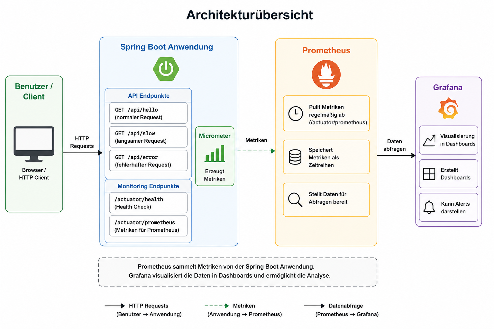
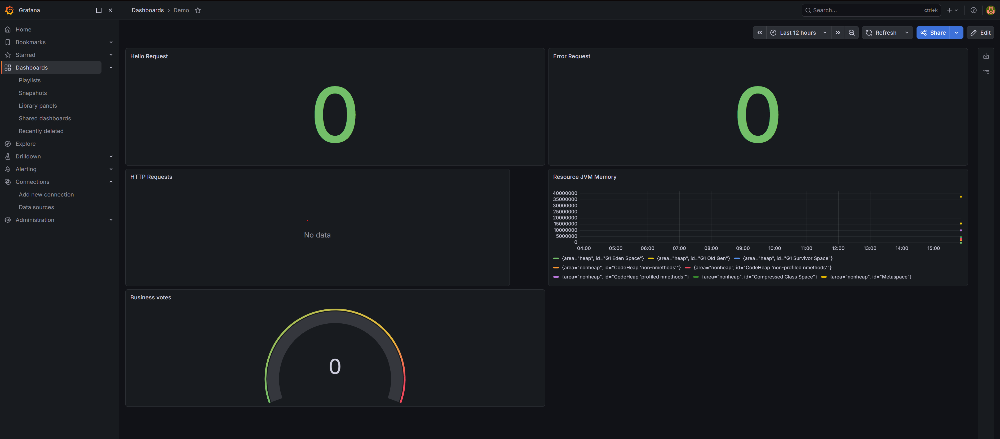
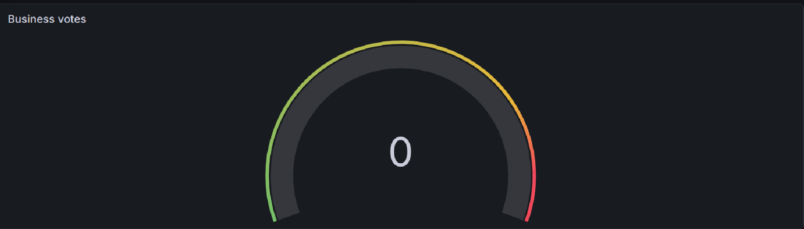
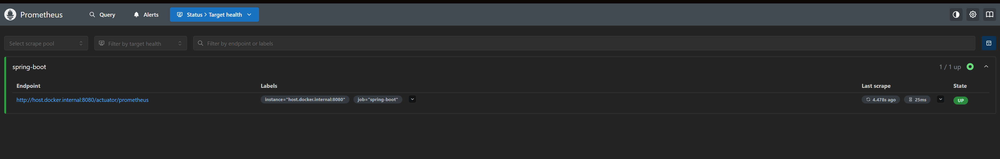
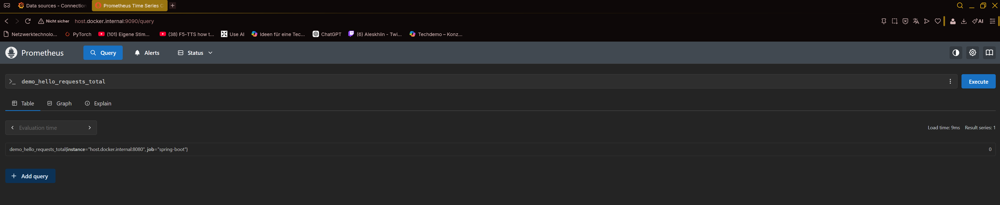
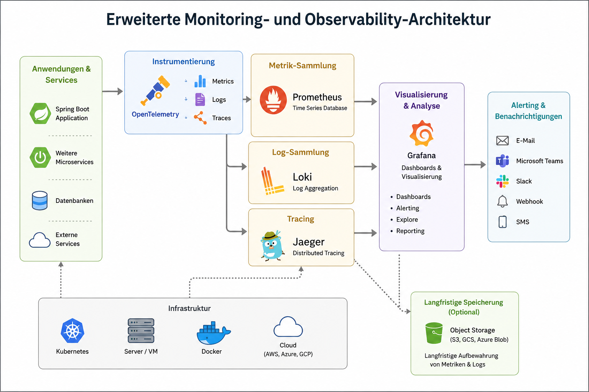
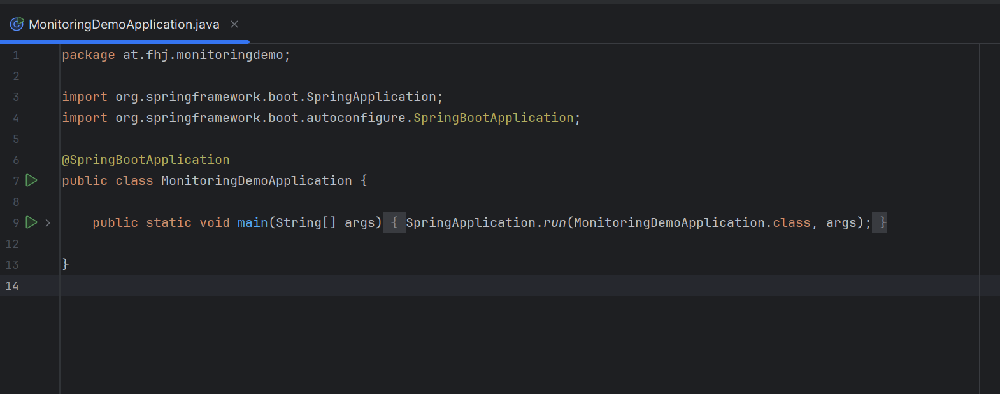
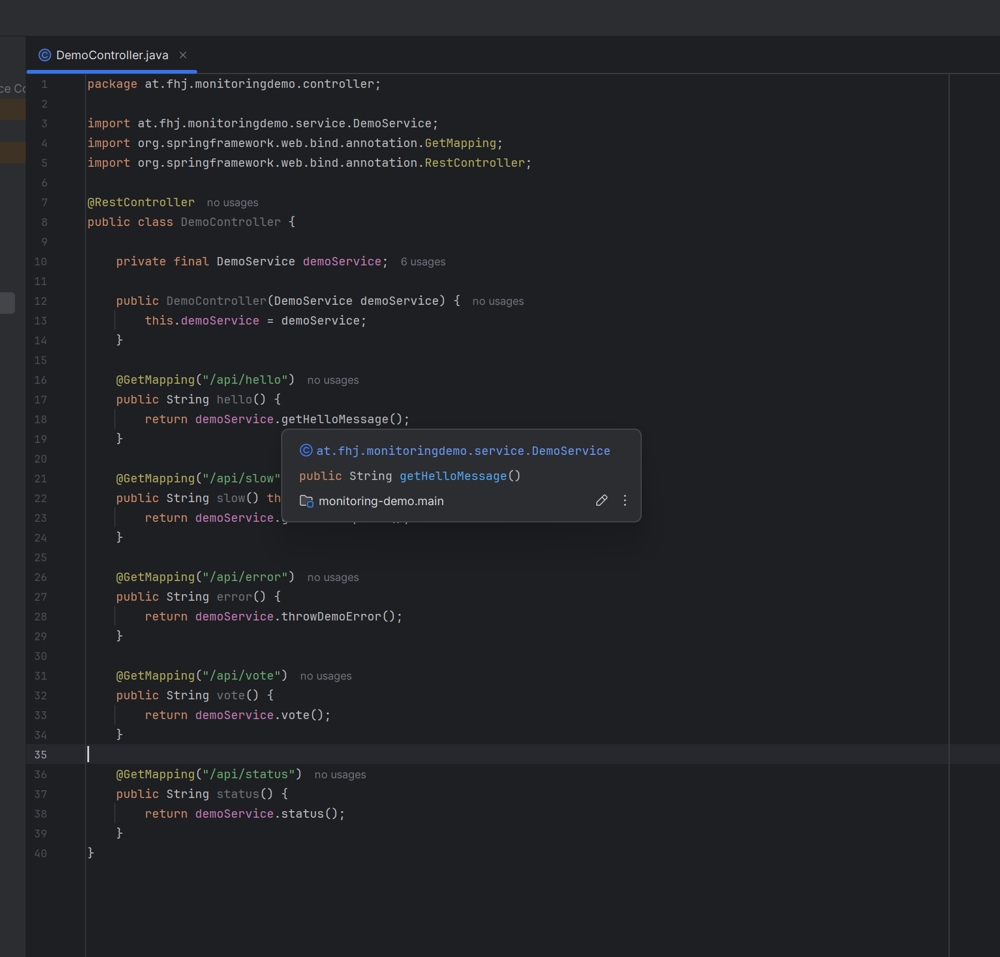
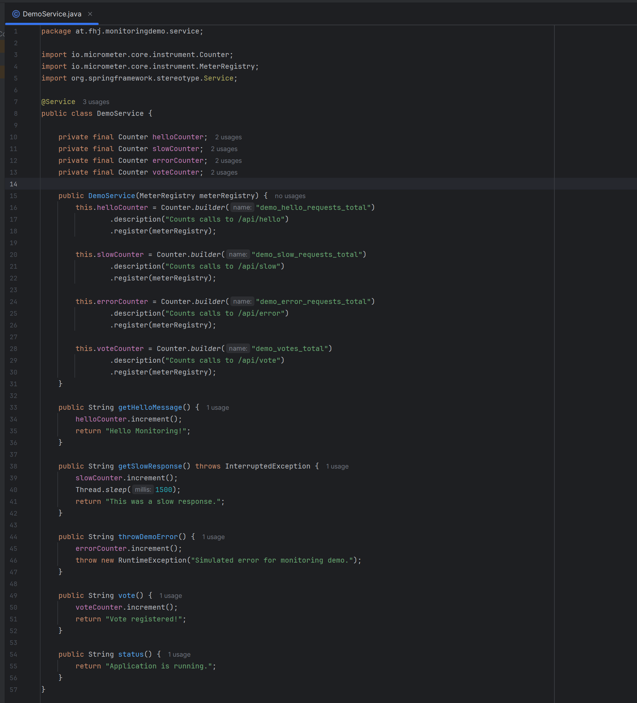

# Dokumentation.md

# Monitoring Konzepte mit Demo-Implementierung in modernen Software-Architekturen

## Software Architektur – SS2026

### Autoren

- Florian Fuchs
- Dominik Bliem-Zupansky

---

# Inhaltsverzeichnis

1. Motivation
2. Zielsetzung
3. Monitoring Grundlagen
4. Monitoring vs Logging
5. Monitoring vs Observability
6. Architektur
7. Komponentenbeschreibung
8. Monitoring Konzepte
9. Technisches Monitoring
10. Business Monitoring
11. Demonstration
12. Erweiterungsmöglichkeiten
13. Fazit
14. Code-Erklärung
15. Datenflussdiagramme

---

# 1. Motivation

Moderne Software-Systeme werden zunehmend komplexer. Anwendungen bestehen häufig nicht mehr aus einem einzigen Programm, sondern aus zahlreichen Komponenten, Services, Datenbanken und externen Schnittstellen.

Mit steigender Komplexität wird es immer schwieriger, Probleme frühzeitig zu erkennen. Fehler können sich auf viele Bereiche des Systems auswirken und häufig erst dann sichtbar werden, wenn Benutzer bereits betroffen sind.

Daher ist Monitoring ein zentraler Bestandteil moderner Software-Architekturen.

Monitoring ermöglicht:

- Früherkennung von Fehlern
- Überwachung der Systemgesundheit
- Analyse von Performance-Problemen
- Erkennen von Lastspitzen
- Überwachung von Geschäftsprozessen
- Verbesserung der Verfügbarkeit

Ohne Monitoring ist ein zuverlässiger Betrieb moderner Anwendungen kaum möglich.

---

# 2. Zielsetzung

Ziel dieses Projekts ist die praktische Umsetzung grundlegender Monitoring-Konzepte innerhalb einer Spring-Boot-Anwendung.

Dabei sollen folgende Fragestellungen beantwortet werden:

- Wie können Anwendungen überwacht werden?
- Welche Informationen sind für Entwickler relevant?
- Welche Informationen sind für Administratoren relevant?
- Wie können technische und fachliche Kennzahlen visualisiert werden?
- Welche Werkzeuge werden im professionellen Umfeld eingesetzt?

Zur Umsetzung wird eine Beispielanwendung entwickelt, welche Metriken erzeugt und diese über Prometheus sammelt sowie über Grafana visualisiert.

---

# 3. Monitoring Grundlagen

Monitoring bezeichnet die kontinuierliche Beobachtung eines Systems durch das Erfassen und Auswerten von Messwerten.

Die gesammelten Daten werden verwendet, um:

- Probleme zu erkennen
- Trends zu analysieren
- Kapazitäten zu planen
- Verfügbarkeit sicherzustellen

Typische Messwerte sind:

```text
CPU-Auslastung
Speicherverbrauch
Antwortzeiten
Anzahl von Requests
Fehlerraten
Benutzeraktivitäten
```

Monitoring liefert dabei einen Überblick über den Zustand eines Systems und unterstützt die Fehleranalyse.

---

## Warum ist Monitoring wichtig?

Ohne Monitoring treten Probleme häufig erst dann in Erscheinung, wenn Benutzer bereits betroffen sind.

Beispiele:

- Eine Anwendung reagiert langsam.
- Die Datenbank ist überlastet.
- Speicher läuft voll.
- Ein Service ist nicht erreichbar.

Monitoring hilft dabei, solche Situationen frühzeitig zu erkennen.

---

# 4. Monitoring vs Logging

Monitoring und Logging verfolgen unterschiedliche Ziele.

## Monitoring

Monitoring beantwortet die Frage:

> Ist das System gesund?

Beispiele:

- Wie viele Requests werden verarbeitet?
- Wie hoch ist die Fehlerrate?
- Wie viel Speicher wird genutzt?

---

## Logging

Logging beantwortet die Frage:

> Warum ist etwas passiert?

Logs enthalten detaillierte Informationen über Ereignisse innerhalb der Anwendung.

Beispiel:

```text
2026-06-09 10:00 User logged in
2026-06-09 10:01 Database connection failed
2026-06-09 10:02 Order created
```

---

## Vergleich

| Monitoring | Logging |
|------------|----------|
| Zeigt Trends | Zeigt Details |
| Numerische Daten | Textbasierte Ereignisse |
| Dashboard-orientiert | Analyse-orientiert |
| Überblick | Ursachenanalyse |

---

# 5. Monitoring vs Observability

Observability erweitert klassisches Monitoring.

Während Monitoring bekannte Probleme sichtbar macht, ermöglicht Observability die Analyse unbekannter Probleme.

Observability basiert auf drei Säulen:

```text
Observability
│
├── Metrics
├── Logs
└── Traces
```

---

## Metrics

Numerische Kennzahlen.

Beispiele:

```text
Requests pro Sekunde
Fehlerraten
Antwortzeiten
Speicherverbrauch
```

---

## Logs

Textbasierte Ereignisse.

Beispiele:

```text
Benutzeranmeldungen
Fehlermeldungen
Systemereignisse
```

---

## Traces

Nachverfolgung eines Requests über mehrere Systeme hinweg.

Beispiel:

```text
Browser
   |
Frontend
   |
Order Service
   |
Payment Service
   |
Database
```

---

# 6. Architektur

## Architekturübersicht

Die entwickelte Lösung besteht aus vier Hauptkomponenten.

```text
                    +------------------+
                    |     Benutzer     |
                    +--------+---------+
                             |
                             |
                             v
                    +------------------+
                    |   Spring Boot    |
                    |   Application    |
                    +--------+---------+
                             |
                  Metrics via Actuator
                             |
                             v
                    +------------------+
                    |    Prometheus    |
                    +--------+---------+
                             |
                             |
                             v
                    +------------------+
                    |     Grafana      |
                    +------------------+
```

---

## Architekturdiagramm



---

## Ablauf

1. Benutzer sendet Requests an die Anwendung.
2. Spring Boot verarbeitet die Requests.
3. Micrometer erzeugt Metriken.
4. Actuator stellt die Metriken bereit.
5. Prometheus sammelt die Daten.
6. Grafana visualisiert die Daten.

---

# 7. Komponentenbeschreibung

## Spring Boot

Spring Boot stellt die eigentliche Geschäftsanwendung bereit.

Aufgaben:

- REST API bereitstellen
- Requests verarbeiten
- Metriken erzeugen

---

## Spring Boot Actuator

Actuator erweitert Spring Boot um Monitoring-Funktionalität.

Wichtige Endpunkte:

```text
/actuator/health
/actuator/metrics
/actuator/prometheus
```

---

## Micrometer

Micrometer dient als Monitoring-Framework.

Eigene Metriken können über Counter erzeugt werden.

Beispiel:

```java
Counter.builder("demo_votes_total")
       .register(meterRegistry);
```

---

## Prometheus

Prometheus sammelt regelmäßig Metriken.

Dieser Vorgang wird als Scraping bezeichnet.

```text
Prometheus
      |
      +----> GET /actuator/prometheus
```

---

## Grafana

Grafana visualisiert die Daten.

Vorteile:

- Dashboards
- Echtzeit-Daten
- Historische Analysen
- Übersichtliche Darstellung

---

## Screenshot

```text
[SCREENSHOT]
grafana-dashboard.png
```


# 8. Monitoring Konzepte

Monitoring umfasst unterschiedliche Bereiche, die gemeinsam dazu beitragen, den Zustand einer Anwendung sowie ihrer Infrastruktur sichtbar zu machen.

In modernen Software-Architekturen reicht es nicht mehr aus, lediglich zu prüfen, ob eine Anwendung läuft. Stattdessen müssen verschiedene Aspekte kontinuierlich überwacht werden.

Im Rahmen dieses Projekts werden folgende Monitoring-Konzepte umgesetzt:

- Health Monitoring
- Request Monitoring
- Error Monitoring
- Resource Monitoring
- Business Monitoring

Diese Konzepte bilden die Grundlage vieler professioneller Monitoring-Lösungen.

---

## Health Monitoring

Health Monitoring dient der Überprüfung, ob eine Anwendung grundsätzlich verfügbar ist.

Die Anwendung stellt hierfür einen Health Endpoint bereit:

```text
/actuator/health
```

Eine erfolgreiche Antwort sieht beispielsweise wie folgt aus:

```json
{
  "status": "UP"
}
```

Der Health Check wird häufig von:

- Load Balancern
- Kubernetes
- Monitoring-Systemen
- Cloud-Plattformen

verwendet, um den Zustand eines Services zu prüfen.

---

## Request Monitoring

Request Monitoring überwacht den eingehenden Datenverkehr einer Anwendung.

Dabei werden unter anderem folgende Informationen erfasst:

- Anzahl der Requests
- Antwortzeiten
- Request Rate
- Erfolgreiche Requests
- Fehlgeschlagene Requests

Beispiele:

```text
100 Requests / Minute
200 Requests / Minute
500 Requests / Minute
```

Mit diesen Informationen können Lastspitzen erkannt werden.

---

## Error Monitoring

Error Monitoring konzentriert sich auf Fehler innerhalb der Anwendung.

Beispiele:

```text
HTTP 500 Fehler
Exceptions
Datenbankfehler
Timeouts
```

Steigt die Anzahl der Fehler plötzlich an, kann dies auf Probleme innerhalb des Systems hinweisen.

---

## Resource Monitoring

Resource Monitoring überwacht die Nutzung von Systemressourcen.

Typische Kennzahlen:

```text
CPU-Auslastung
RAM-Verbrauch
Threads
Netzwerkauslastung
Festplattennutzung
```

Im Rahmen der Demo wird insbesondere der Speicherverbrauch der JVM überwacht.

---

## Business Monitoring

Business Monitoring betrachtet fachliche Kennzahlen.

Im Gegensatz zum technischen Monitoring stehen hier Geschäftsprozesse im Mittelpunkt.

Beispiele:

```text
Bestellungen
Registrierungen
Downloads
Logins
Transaktionen
```

In der Demo wird dies über einen Vote Counter simuliert.

---

# 9. Technisches Monitoring

Technisches Monitoring konzentriert sich auf die Überwachung der technischen Eigenschaften einer Anwendung.

Das Ziel besteht darin, Probleme möglichst frühzeitig zu erkennen und die Stabilität des Systems sicherzustellen.

---

## HTTP Requests

Die Anzahl der HTTP Requests liefert Informationen über die aktuelle Auslastung der Anwendung.

Verwendete Metrik:

```promql
http_server_requests_seconds_count
```

Visualisierung:

```text
Time Series
```

Dadurch kann nachvollzogen werden, wie sich die Anzahl der Requests im Zeitverlauf entwickelt.

---

## Antwortzeiten

Antwortzeiten gehören zu den wichtigsten Monitoring-Kennzahlen.

Langsame Antworten wirken sich direkt auf die Benutzererfahrung aus.

Zur Demonstration wurde der Endpoint:

```text
/api/slow
```

implementiert.

Dieser simuliert eine langsame Verarbeitung.

```java
Thread.sleep(1500);
```

Dadurch entstehen messbare Verzögerungen.

---

## Fehlerüberwachung

Für die Fehlerüberwachung wurde ein eigener Fehler-Endpunkt erstellt:

```text
/api/error
```

Dieser erzeugt bewusst eine Runtime Exception.

```java
throw new RuntimeException(...)
```

Zusätzlich wird ein eigener Counter erhöht:

```java
errorCounter.increment();
```

Dadurch entsteht die Metrik:

```promql
demo_error_requests_total
```

Visualisierung:

```text
Stat
```

---

## JVM Speicherverbrauch

Die JVM stellt zahlreiche Metriken automatisch bereit.

Eine wichtige Kennzahl ist:

```promql
jvm_memory_used_bytes
```

Visualisierung:

```text
Time Series
```

Diese Metrik zeigt den aktuell verwendeten Speicher der Java Virtual Machine.

---

## Health Monitoring

Zusätzlich wird der Zustand der Anwendung überwacht.

Endpoint:

```text
/actuator/health
```

Visualisierung:

```text
UP / DOWN
```

Diese Information wird häufig von Kubernetes oder Load Balancern verwendet.

---

## Dashboard – Technisches Monitoring

```text
┌─────────────────────┬─────────────────────┐
│ Hello Requests      │ Error Requests      │
└─────────────────────┴─────────────────────┘

┌─────────────────────┬─────────────────────┐
│ JVM Memory          │ Health Status       │
└─────────────────────┴─────────────────────┘

┌───────────────────────────────────────────┐
│ HTTP Requests                             │
└───────────────────────────────────────────┘
```

---

## Screenshot



---

# 10. Business Monitoring

Während technisches Monitoring den Zustand der Anwendung betrachtet, konzentriert sich Business Monitoring auf fachliche Kennzahlen.

Business Monitoring beantwortet Fragen wie:

```text
Wie viele Benutzer verwenden die Anwendung?
Wie viele Bestellungen wurden durchgeführt?
Wie viele Registrierungen gab es?
Wie viele Transaktionen wurden verarbeitet?
```

Diese Informationen sind besonders für:

- Product Owner
- Projektleiter
- Management
- Fachabteilungen

interessant.

---

## Business Monitoring in der Demo

Für die Demonstration wurde eine eigene Business-Metrik implementiert.

Endpoint:

```text
/api/vote
```

Bei jedem Aufruf wird ein Counter erhöht.

```java
voteCounter.increment();
```

Dadurch entsteht die Metrik:

```promql
demo_votes_total
```

---

## Warum Votes?

Votes simulieren Benutzeraktionen.

In einer realen Anwendung könnten stattdessen folgende Kennzahlen verwendet werden:

```text
Bestellungen
Registrierungen
Logins
Downloads
Käufe
```

Die technische Umsetzung bleibt identisch.

---

## Visualisierung

Für die Darstellung wurde ein Gauge verwendet.

Query:

```promql
demo_votes_total
```

Visualisierung:

```text
Gauge
```

Empfohlene Einstellungen:

```text
Min: 0
Max: 100
```

---

## Warum ein Gauge?

Ein Gauge eignet sich besonders gut für Business-Kennzahlen.

Vorteile:

- Leicht verständlich
- Sofort erkennbarer Fortschritt
- Gute Präsentationswirkung

Beispiel:

```text
Business Votes

████████░░░░░░░░░░░░

40 / 100
```

---

## Dashboard – Business Monitoring

```text
┌─────────────────────┐
│ Business Votes      │
│       Gauge         │
└─────────────────────┘
```

---

## Screenshot



---

## Technisches Monitoring vs Business Monitoring

| Technisches Monitoring | Business Monitoring |
|-----------------------|---------------------|
| CPU | Bestellungen |
| RAM | Registrierungen |
| Fehler | Käufe |
| Requests | Logins |
| Antwortzeiten | Benutzeraktionen |

Beide Arten von Monitoring ergänzen sich.

Erst die Kombination aus technischen und fachlichen Kennzahlen liefert ein vollständiges Bild über den Zustand einer Anwendung.

# 11. Demonstration

## Ziel der Demonstration

Die Demonstration soll zeigen, wie Monitoring-Daten in Echtzeit erfasst, gesammelt und visualisiert werden können.

Dabei werden sowohl technische als auch fachliche Kennzahlen betrachtet.

Die Demonstration dauert etwa 3 bis 4 Minuten und ist bewusst einfach gehalten, um die grundlegenden Konzepte verständlich zu vermitteln.

---

## Demonstrationsaufbau

Folgende Komponenten werden während der Demonstration verwendet:

```text
Spring Boot
Prometheus
Grafana
Browser
```

---

## Ausgangssituation

Vor Beginn der Demonstration werden folgende Komponenten gestartet:

```text
Spring Boot Application
Prometheus
Grafana
```

Anschließend wird das Grafana Dashboard geöffnet.

---

## Schritt 1 – Health Check

Zunächst wird überprüft, ob die Anwendung korrekt läuft.

Endpoint:

```text
http://localhost:8080/actuator/health
```

Erwartete Ausgabe:

```json
{
  "status": "UP"
}
```

Bedeutung:

Die Anwendung ist erreichbar und funktionsfähig.

---

## Schritt 2 – Hello Requests erzeugen

Anschließend wird mehrfach folgender Endpoint aufgerufen:

```text
/api/hello
```

Beispiel:

```text
http://localhost:8080/api/hello
```

Antwort:

```text
Hello Monitoring!
```

Dadurch wird die Metrik:

```promql
demo_hello_requests_total
```

erhöht.

Im Dashboard steigt der entsprechende Counter an.

---

## Schritt 3 – Business Events erzeugen

Nun wird der Vote Endpoint aufgerufen.

```text
/api/vote
```

Antwort:

```text
Vote registered!
```

Dadurch wird die Business-Metrik:

```promql
demo_votes_total
```

erhöht.

Im Dashboard steigt die Gauge-Anzeige.

---

## Schritt 4 – Fehler simulieren

Nun wird ein Fehler erzeugt.

Endpoint:

```text
/api/error
```

Antwort:

```text
HTTP 500
```

Zusätzlich wird:

```promql
demo_error_requests_total
```

erhöht.

Dadurch wird sichtbar, wie Fehler im Monitoring erkannt werden können.

---

## Schritt 5 – Langsame Requests simulieren

Anschließend wird der Endpoint:

```text
/api/slow
```

aufgerufen.

Die Anwendung wartet bewusst:

```java
Thread.sleep(1500);
```

Dadurch entstehen längere Antwortzeiten.

Im Dashboard lässt sich die Auswirkung auf die Request-Metriken beobachten.

---

## Schritt 6 – Prometheus Query

Prometheus öffnen:

```text
http://localhost:9090
```

Beispiel:

```promql
demo_votes_total
```

Dadurch wird gezeigt, dass die Metriken tatsächlich gesammelt werden.

---

## Schritt 7 – Dashboard Analyse

Abschließend wird das Dashboard betrachtet.

Folgende Informationen sind sichtbar:

- Anzahl der Requests
- Anzahl der Fehler
- Business Votes
- JVM Speicherverbrauch

Dadurch entsteht ein vollständiger Überblick über den Zustand der Anwendung.

---

## Screenshots






---

# 12. Erweiterungsmöglichkeiten

Die entwickelte Lösung stellt eine einfache Monitoring-Infrastruktur dar.

In produktiven Anwendungen werden häufig weitere Komponenten eingesetzt.

---

## Alerting

Aktuell werden lediglich Metriken angezeigt.

In realen Systemen müssen Administratoren jedoch automatisch informiert werden.

Beispiele:

```text
CPU > 90%
RAM > 95%
Service DOWN
Fehlerrate > 5%
```

Mögliche Benachrichtigungssysteme:

- E-Mail
- Microsoft Teams
- Slack
- SMS

---

## Distributed Tracing

In Microservice-Architekturen reicht klassisches Monitoring häufig nicht aus.

Ein Request durchläuft oft mehrere Services.

Beispiel:

```text
Browser
    |
Frontend
    |
Order Service
    |
Payment Service
    |
Database
```

Distributed Tracing ermöglicht die Nachverfolgung eines Requests über sämtliche beteiligten Systeme.

---

## OpenTelemetry

OpenTelemetry gilt heute als Standard für moderne Observability-Lösungen.

Es ermöglicht:

- Metrics
- Logs
- Traces

über eine gemeinsame Schnittstelle zu erfassen.

Mögliche Integration:

```text
Spring Boot
      |
OpenTelemetry
      |
Jaeger / Grafana / Prometheus
```

---

## Zentrales Logging

Aktuell werden keine Logs zentral gesammelt.

Mögliche Erweiterungen:

```text
Loki
Elasticsearch
Kibana
```

Dadurch können Logs systemübergreifend durchsucht werden.

---

## Kubernetes Monitoring

Bei größeren Anwendungen werden häufig Kubernetes-Cluster eingesetzt.

Hier können zusätzliche Kennzahlen überwacht werden.

Beispiele:

```text
Pods
Deployments
Nodes
Namespaces
Container
```

Werkzeuge:

- Prometheus Operator
- Grafana
- Kube State Metrics

---

## Cloud Monitoring

Auch Cloud-Plattformen bieten eigene Monitoring-Lösungen.

Beispiele:

- AWS CloudWatch
- Azure Monitor
- Google Cloud Monitoring

---

## Architektur einer erweiterten Lösung

```text
                     +------------------+
                     |     Benutzer     |
                     +--------+---------+
                              |
                              v
                     +------------------+
                     |   Spring Boot    |
                     +--------+---------+
                              |
                              |
         +--------------------+-------------------+
         |                    |                   |
         v                    v                   v
    Prometheus             Loki              OpenTelemetry
         |                    |                   |
         +--------------------+-------------------+
                              |
                              v
                         Grafana
                              |
                              v
                           Alerting
```

---

## Screenshot



---

# 13. Fazit

Im Rahmen dieses Projekts wurde eine vollständige Monitoring-Lösung auf Basis moderner Open-Source-Technologien entwickelt.

Zum Einsatz kamen:

- Spring Boot
- Spring Boot Actuator
- Micrometer
- Prometheus
- Grafana
- Docker

Die entwickelte Anwendung erzeugt sowohl technische als auch fachliche Kennzahlen und stellt diese für Monitoring-Systeme bereit.

Prometheus sammelt die Daten regelmäßig und Grafana visualisiert diese über Dashboards.

---

## Erkenntnisse

Während der Umsetzung konnten folgende Erkenntnisse gewonnen werden:

### Monitoring ist unverzichtbar

Ohne Monitoring bleiben viele Probleme lange unbemerkt.

---

### Technisches Monitoring alleine reicht nicht aus

CPU-Auslastung und Speicherverbrauch liefern wichtige Informationen, sagen jedoch nichts über Geschäftsprozesse aus.

---

### Business Monitoring ergänzt technische Kennzahlen

Erst die Kombination beider Sichtweisen ermöglicht eine ganzheitliche Bewertung eines Systems.

---

### Open-Source Werkzeuge bieten professionelle Möglichkeiten

Prometheus und Grafana stellen leistungsfähige Lösungen dar, die auch in produktiven Umgebungen eingesetzt werden.

---

# 14. Code-Erklärung

## Klassenübersicht

```text
MonitoringDemoApplication
        |
        |
        v
DemoController
        |
        |
        v
DemoService
        |
        |
        v
Micrometer Counter
```

---

## MonitoringDemoApplication

Diese Klasse stellt den Einstiegspunkt der Anwendung dar.

```java
@SpringBootApplication
public class MonitoringDemoApplication {

    public static void main(String[] args) {
        SpringApplication.run(
            MonitoringDemoApplication.class,
            args
        );
    }
}
```

### Aufgaben

- Spring Context starten
- Komponenten laden
- Embedded Tomcat starten

---

## DemoController

Der Controller stellt sämtliche REST-Endpunkte bereit.

```java
@RestController
public class DemoController
```

### Verantwortlichkeiten

- HTTP Requests entgegennehmen
- Service aufrufen
- Responses zurückgeben

---

### Verfügbare Endpunkte

```text
/api/hello
/api/slow
/api/error
/api/vote
/api/status
```

---

## DemoService

Der Service enthält die eigentliche Geschäftslogik.

### Counter

```java
private final Counter helloCounter;
private final Counter slowCounter;
private final Counter errorCounter;
private final Counter voteCounter;
```

---

### Hello Counter

```java
helloCounter.increment();
```

Erfasst erfolgreiche Requests.

---

### Slow Counter

```java
slowCounter.increment();
```

Erfasst langsame Requests.

---

### Error Counter

```java
errorCounter.increment();
```

Erfasst Fehler innerhalb der Anwendung.

---

### Vote Counter

```java
voteCounter.increment();
```

Erfasst Business Events.

---

## Monitoring durch Micrometer

Micrometer verbindet die Anwendung mit Prometheus.

Beispiel:

```java
Counter.builder("demo_votes_total")
       .description("Counts votes")
       .register(meterRegistry);
```

Dadurch entsteht automatisch eine Prometheus-Metrik.

---

## Screenshots







---

# 15. Datenflussdiagramme

## Gesamter Datenfluss

```text
Benutzer
    |
    v
Spring Boot
    |
    v
Micrometer
    |
    v
Actuator
    |
    v
Prometheus
    |
    v
Grafana
```

---

## Datenfluss eines Requests

```text
/api/hello
      |
      v
DemoController
      |
      v
DemoService
      |
helloCounter.increment()
      |
      v
Micrometer
      |
      v
Actuator
      |
      v
Prometheus
      |
      v
Grafana
```

---

## Datenfluss eines Business Events

```text
/api/vote
      |
      v
DemoController
      |
      v
DemoService
      |
voteCounter.increment()
      |
      v
Micrometer
      |
      v
Actuator
      |
      v
Prometheus
      |
      v
Grafana
```

---

## Datenfluss eines Fehlers

```text
/api/error
      |
      v
DemoController
      |
      v
DemoService
      |
errorCounter.increment()
      |
RuntimeException
      |
      v
Micrometer
      |
      v
Actuator
      |
      v
Prometheus
      |
      v
Grafana
```

---

## Zusammenfassung des Datenflusses

Das Monitoring-System arbeitet vollständig automatisiert.

Jede Benutzeraktion erzeugt Metriken innerhalb der Anwendung.

Diese Metriken werden:

1. durch Micrometer erfasst,
2. durch Actuator bereitgestellt,
3. von Prometheus gesammelt,
4. und schließlich in Grafana visualisiert.

Dadurch entsteht eine vollständige Monitoring-Pipeline, die sowohl technische als auch fachliche Kennzahlen sichtbar macht.